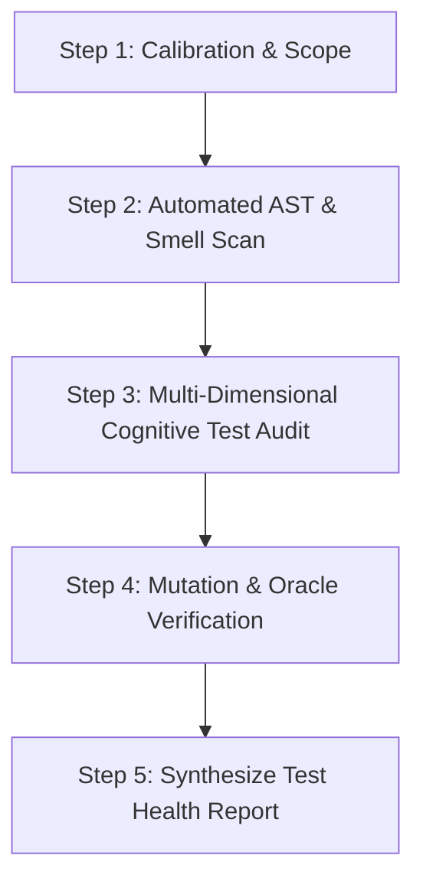

# Workflow: /test-health

This workflow performs a deep, sophisticated quality audit of the test suite across both Dart/Flutter and Rust tiers.

Unlike a simple pass/fail run or raw line-coverage metric, this workflow evaluates **defect-detection capability, test oracle rigor, test double fidelity, temporal determinism, FSM invariant completeness, and mutation survival**.

---

## Workflow Protocol



---

## Audit Dimensions & Check Factors

Each test file in scope is rigorously evaluated against these 6 sophisticated quality dimensions:

### 1. 🔹 Test Oracle & Assertion Rigor (The False Confidence Barrier)
* **Vacuous & Tautological Assertions:**
  - `expect(true, isTrue)`, `expect(x, equals(x))`, `expect(anything)`.
  - Asserting on constants or re-verifying trivial constructor assignments instead of observable state mutations.
* **Assertionless Executions (Smoke-Only Masquerading):**
  - Tests that pump widgets, call methods, or trigger events with zero `expect()`, `verify()`, or state inspections.
* **Unawaited Async Expectations:**
  - Unawaited `expectLater()` invocations where stream errors fail silently after the test function finishes.
* **Shallow vs Deep Oracles:**
  - Testing only `expect(result, isNotNull)` or `result.length > 0` when exact structural invariants, delta properties, or mathematical coordinates should be verified.

### 2. 🔹 Test Double Fidelity & Mocking Hygiene (The Mock Sprawl Trap)
* **Raw Mocks on Core Engines:**
  - Use of raw `MockGraphApi` or `MockInteractionContext` with brittle `when()` chains instead of high-fidelity in-memory fakes (`InMemoryGraphApi`, `FakeInteractionContext`).
* **Implementation Coupling (Overspecified Mocks):**
  - Verifying internal private calls or exact sequence of intermediate helper queries rather than black-box domain outcomes.
* **Interface Drift & Broken Stubs:**
  - Stubs returning mock fallbacks or arbitrary nulls that mask real domain contract changes.
* **Hermetic Isolation & State Leakage:**
  - Shared mutable singletons or static caches that pollute sibling tests. Missing `setUp` / `tearDown` resets.

### 3. 🔹 Temporal Determinism & Async Flakiness (The Clock & Timing Dimension)
* **Wall-Clock Sleep Pollution:**
  - Usage of `Future.delayed()`, `sleep()`, or real-time timeouts in tests.
  - Required pattern: `fakeAsync`, `tester.pump()`, or `GestureTestHarness.advanceTime()`.
* **Arbitrary Microtask Pumping:**
  - Brittle multi-pump hacks (`await tester.pump(Duration(milliseconds: 100))`) used as a timing band-aid for unsynchronized streams.
* **Virtual Timestamp Gesture Invariance:**
  - Canvas gesture tests must pass discrete, reproducible `timeStamp` sequences (`PointerDownEvent`, `PointerMoveEvent`, `PointerUpEvent`) through `GestureTestHarness`.

### 4. 🔹 FSM State & Invariant Coverage (The State Machine Dimension)
* **State Transition Completeness:**
  - Are all valid transitions and illegal transition rejections exercised across active FSM states (`CanvasIdle`, `MarqueeSelecting`, `DraggingNodes`, `RoutingEdge`)?
* **Cancellation & Panic Invariants:**
  - Does the test verify that unexpected disruptions (`PointerCancelEvent`, blur, unhandled exceptions) unconditionally restore canvas responsiveness (`panScaleEnabled == true`)?
* **Algebraic Reversibility (Undo / Redo):**
  - $\forall \text{ Action } A: \quad \text{Redo}(\text{Undo}(A)) \equiv A$.
  - Tests must verify that graph snapshots before and after undo-redo cycles are structurally and topologically identical.

### 5. 🔹 Cross-Tier FFI & Serialization Parity (The Boundary Dimension)
* **Dual-Run Contract Parity:**
  - Do `InMemoryGraphApi` and Rust SurrealDB (`Surreal::new::<Mem>(())`) produce identical snapshots when executed against `graph_api_contract_suite.dart`?
* **Domain Struct Roundtrip Parity:**
  - Are boundary edge cases tested (UUID formatting, extreme coordinates, nested styling enums, empty collections, UTF-8 strings)?
* **Relational Cascading Symmetry:**
  - Do node deletions in memory correctly purge connected relations without leaving ghost hitboxes?

### 6. 🔹 Mutation Resistance & Defect Power (The Mutation Gate Dimension)
* **Surviving Mutants:**
  - Running `cargo mutants --in-diff` to detect if mutations in domain math, spatial grids, or state logic survive undetected by the test suite.
* **High-Coverage / Low-Detection Hotspots:**
  - Identifying modules that report 90%+ line coverage but have 0 assertion-level protection against logic inversions.

---

## Execution Steps

### Step 1: Calibration & Test Scope Identification
1. Identify the target test directory or test files:
   - Specific feature: `test/features/graph/store/`, `test/features/graph/engine/`
   - Full suite: `test/` and `rust/tests/`
2. Calibrate against [.agents/rules/test-architecture.md](.agents/rules/test-architecture.md) and [.agents/rules/tdd-red-gate.md](.agents/rules/tdd-red-gate.md).

### Step 2: Automated AST Smell Scan
Run the automated AST analyzer to detect static test smells:
```bash
dart run scripts/quality/dart_test_smell_visitor.dart <target_directory>
```
Record all detected violations:
- `NO_ASSERTIONS`
- `VACUOUS_ASSERTION`
- `NO_WALL_CLOCK_SLEEP`
- `UNAWAITED_EXPECT_LATER`

### Step 3: Multi-Dimensional Cognitive Code Review
Read the source code of target test files using `view_file` and evaluate them against the **6 Check Dimensions**.

For each finding, categorize by:
- **Location:** `[test_file.dart:line_range]`
- **Dimension:** (e.g. `Test Double Fidelity`, `Temporal Determinism`, `FSM State Invariants`)
- **Severity:** `CRITICAL` (false positive/negative risk), `WARNING` (flakiness/brittleness), `INFO` (hygiene)
- **Defect Mechanism:** Why this test fails to catch real bugs or will flake under load.

### Step 4: Mutation & Invariant Verification (Optional / Targeted)
For critical domain or persistence algorithms:
- Run Rust diff-scoped mutants:
  ```bash
  cd rust && cargo mutants --in-diff "git diff origin/main...HEAD"
  ```
- Run Dart contract suites:
  ```bash
  flutter test test/features/graph/store/in_memory_graph_api_test.dart
  ```

### Step 5: Synthesize Test Health Report
Present a structured, prioritized Test Health Audit Report:

1. **Executive Scorecard:** Health score per dimension (A / B / C / F).
2. **AST Static Smell Violations:** List of automated linter flags with line links.
3. **Cognitive Audit Findings:** Detailed breakdown of mock sprawl, vacuous assertions, and missing state invariants.
4. **Actionable Remediation Backlog:** Concrete list of refactorings ordered by ROI (e.g. replace `MockGraphApi` with `InMemoryGraphApi`, migrate `Future.delayed` to `fakeAsync`, add `PointerCancelEvent` tests).
