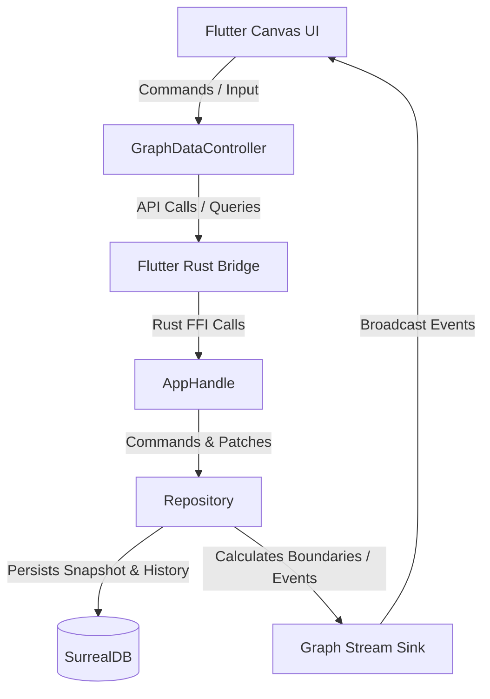

# Centrode 🍄

A high-performance, canvas-based visual knowledge graphing and relational mapping environment. Centrode combines a fluid, hardware-accelerated Flutter frontend with an embedded SurrealDB-powered Rust core via FFI, allowing users to build complex, structured, and beautiful maps of interrelated ideas.

---

## 🌟 Key Features

### 1. Interactive Infinite Canvas
* **Fluid Navigation:** Pan, zoom, and snap-to-grid movement for editing complex, large-scale maps.
* **Rich Layout Overlays:** Toggleable sidebars, repository drawer panels, right-side property inspectors, and status indicators.
* **On-Canvas Text Editing:** Inline text editor widgets (`CanvasTextEditor`) allow direct double-click text modifications.
* **Layered Painting Pipeline:** Custom painting layers separating grid rendering, node representations, relations routing, and overlay helpers.

### 2. Multi-Node Taxonomy
* **Info Nodes (`INode` / `InfoUiNode`):** Rich content nodes featuring markdown, tags, alias structures, inline comments, and local file attachments.
* **Tasks (`TaskNode` / `TaskUiNode`):** Actionable items with state tracking (`Done`/`Not Done`) and due-date associations.
* **Frames (`FrameNode` / `FrameUiNode`):** Visual boundary boxes that allow logical containment and grouping of sub-nodes.
* **Drawing Nodes (`DrawingNode` / `DrawingUiNode`):** Path vectors representing freehand vector annotations.
* **Comments (`CommentNode` / `CommentUiNode`):** Text blocks for lightweight annotations on the canvas.
* **Verbs / Relations Intersections (`InterNode` / `InterUiNode`):** Special nodes to represent complex multi-way connections and relationship verbs.
* **Shapes (`ShapeNode` / `ShapeUiNode`) & Media (`MediaNode` / `MediaUiNode`):** Layout blocks for embedding standard primitives or image/video URLs.

### 3. Connection & Routing Engine
* **Dynamic Bezier Routing:** Connections dynamically compute layout paths around obstacle nodes using specialized layouts like `BezierRelationLayoutStrategy`.
* **Connection Rerouting:** Dynamically detach and re-attach connection endpoints on the canvas.
* **Relation Styling:** Custom layout styles, stroke weights, directional cues, and aesthetic overlays resolved dynamically via style strategies.

### 4. High-Performance Rust Core Backend (`centrode_core`)
* **Bilingual Architecture:** Powered by a local Rust library (`centrode_core`) bound to Flutter via Flutter Rust Bridge (FRB v2).
* **SurrealDB Embedded Database:** Employs an embedded instance of SurrealDB (with Key-Value storage via Surrealkv and memory support) to manage records and relations locally.
* **State-level Undo/Redo Engine:** Changes are recorded as symmetric entity patches, allowing complete state restoration and forward history walking directly from the database level.
* **Telemetry Streaming:** Low-latency telemetry log stream bridging Rust's `tracing` framework into the Flutter runtime.

### 5. Zipped Portable Package Format (`.cent`)
* **Self-Contained Maps:** Saves the entire canvas workspace as a zipped `.cent` package.
* **MessagePack Serialization:** Encodes the SurrealDB graph snapshot using efficient binary MessagePack serialization (`graph.msgpack`).
* **Embedded Attachments:** Automatically collects and bundles local file/media attachments into the compressed `.cent` archive.

### 6. Liquid Glass & Rich Aesthetics
* **Liquid Glass Shader:** Implements a premium glassmorphic blending effect via a custom GLSL fragment shader (`shaders/liquid_glass.frag`). The shader features:
  * Rounded-rect Signed Distance Fields (SDFs) with smooth `smin` union blending for organic node bridges.
  * Refraction distortion and physical-coordinate radial blur.
  * Directional rim lighting (lightbands) and angular specular highlights.
* **Extensive Custom Theming:** Dynamic JSON-based theme management loading stylesheets directly into the Flutter runtime, supporting fluid transitions.

---

## 🏗️ Architecture & Project Structure

The project is structured as a bilingual Flutter + Rust application:

```
centrode/
├── lib/                             # Flutter frontend application
│   ├── main.dart                    # Application boots, initializes Rust FFI, and loads themes
│   ├── features/
│   │   ├── workspace/               # Project management & selector screens
│   │   └── graph/                   # Infinite canvas, UI overlays, and node editing
│   │       ├── engine/              # Interaction states, controllers, and routing
│   │       ├── models/              # Frontend node, relation, and command models
│   │       ├── presentation/        # State managers, theme controller, and viewport controllers
│   │       ├── store/               # Sync engine, mutations, and database queries
│   │       └── ui/                  # Canvas widgets, rendering layers, and side panels
│   ├── infrastructure/              # Telemetry, logger hooks, and device services
│   └── shared/                      # Shared widgets, glass panel rendering, and common code
├── packages/
│   └── centrode_codegen/            # Custom Dart build_runner generator for UI nodes
├── rust/                            # Rust centrode_core crate
│   ├── Cargo.toml                   # Rust dependency configuration (SurrealDB, FRB, tokio)
│   └── src/
│       ├── bridge/                  # FFI endpoints exposed via flutter_rust_bridge
│       ├── domain/                  # Node/relation structs, patches, and schema definitions
│       ├── format/                  # .cent packager implementation (Zip & MessagePack)
│       ├── persistence/             # SurrealDB connection, schema queries, and history manager
│       ├── plugin_system/           # Extension layer for external features
│       └── telemetry.rs             # Log subscriber bridging to the frontend
├── shaders/                         # GLSL fragment shaders for UI rendering
└── assets/                          # App assets, including default themes and images
```

### System Data Flow


---

## 🛠️ Development Setup & Run

### Prerequisites
1. **Flutter SDK** (Channel Stable, version matches SDK constraints in `pubspec.yaml`).
2. **Rust Toolchain** (via `rustup`).
3. **LLVM** (required by `flutter_rust_bridge_codegen` for binding generation).

### Installation & Run

1. **Clone the repository and install packages:**
   ```bash
   flutter pub get
   ```

2. **Code Generation:**
   Generate FFI bindings and UI node models by running:
   ```bash
   # Run the build_runner for code generation (freezed, JSON serialization, and custom UI node generation)
   flutter pub run build_runner build --delete-conflicting-outputs
   ```
   Ensure the Rust bridge code compiles and bindings are generated automatically.

3. **Run in Development Mode & Build Releases:**
   To compile the Rust library and run the Flutter application:
   ```bash
   flutter run -d windows          # Run on Windows
   flutter run -d android          # Run on Android device or emulator
   ```
   *(Note: Supports Windows, Android, Linux, and macOS platforms).*

   To build release binaries:
   ```bash
   flutter build windows --release # Build Windows binary
   flutter build apk --release     # Build standalone Android APK
   flutter build appbundle --release # Build Android AppBundle (AAB)
   ```

### Version Synchronization
Keep versions in sync across `pubspec.yaml`, `rust/Cargo.toml`, and `windows/installer.iss`:
```bash
dart scripts/sync_version.dart 0.6.0
```

### Rust Core Tests
To execute backend logic, SurrealDB queries, and history engine tests:
```bash
cd rust
cargo test
```

---

## 🎨 Development Guidelines

* **Autogenerated Files:** All files generated by code generators (`*.g.dart`, `*.freezed.dart`, `graph_node.ui.dart`) and the SurrealDB schema (`rust/src/persistence/schema.surql`) are autogenerated. Modify the annotated source models or schema definitions and re-run code generators instead of editing these directly.
* **Git Operations:** Staging deletions, renames, and moves should be done using Git CLI tools directly (`git rm` and `git mv`) to preserve file history.
* **Boundary Enforcement:** Respect layer alignment guidelines. Lower-tier dependencies (e.g., Domain, Persistence) must never import from higher-tier layers (e.g., Presentation, UI).
