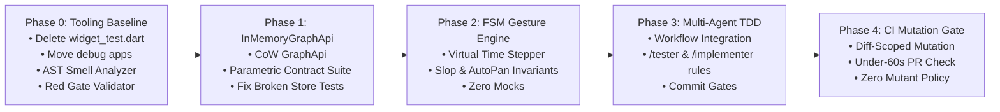

# Centrode Test Suite Refactoring Report & Quality System Blueprint

**Date:** 2026-08-17  
**Status:** Matured & Execution-Ready Blueprint  

---

## Part 1: Current State Audit & Baseline Metrics

### Test Inventory & Execution Baseline

| Category | Files | Tests | Baseline Status | Notes |
|---|---|---|---|---|
| Dart unit/widget tests (`test/`) | 44 | ~183 | 178 passing, 43 failing | Failures caused by `MockGraphApi` mocktail sprawl missing newer `GraphApi` methods (e.g. `undoCount`) |
| Debug apps masquerading as tests | 4 | 0 | Manual `flutter run` | Located in `test/widget_test/` — polluting test runners |
| Sanity check test (`expect(true, isTrue)`) | 1 | 1 | Deleted in Phase 0 | `test/widget_test.dart` — 0 behavioral value |
| Integration tests (`integration_test/`) | 1 | 1 | Passing | Smoke test |
| Rust backend tests (`rust/src/` & `rust/tests/`) | 4 suites | 111 | 111 passing (100%) | Core tests (70), diagnostics (30), layout (4), unit (7) |
| **Total Automated Suites** | **49** | **~295** | **Mixed** | **Target: 100% deterministic green with zero mocktail sprawl** |

### Structural Vulnerabilities

1. **Mocktail Sprawl (The Mock Fragility Trap):** Over 10 test files define inline `class MockGraphApi extends Mock implements GraphApi {}`. Whenever `GraphApi` evolves (e.g., adding `undoCount()`, `redoCount()`), all mocktail tests crash with `type 'Null' is not a subtype of type 'Future<int>'` because mocks are un-hydrated stubs that do not model real state transitions.
2. **The Test Oracle Problem & LLM Self-Deception:** LLM agents generate tests that validate current code bugs as expected behavior. Without formal behavioral contracts, agents produce up to 68% bug-validating tests.
3. **Timer Flakiness in Gesture Tests:** Canvas gesture tests frequently rely on async timers and frame delays, introducing race conditions under CI throttling.
4. **Zero AST Linting for Test Smells:** Tests with vacuous assertions (`expect(x != null, isTrue)`), assertion-less widget pumps, or unawaited `expectLater` calls slip into the codebase undetected.

---

## Part 2: Agentic Quality Architecture (CSIV Topology)

To eliminate the Tautology Trap where an AI agent validates its own logic errors, Centrode adopts the **Coordinator-Spec-Implementer-Verifier (CSIV)** multi-agent testing model:

```
                       ┌─────────────────────────┐
                       │   Coordinator Agent     │
                       │  (Scope & Invariants)   │
                       └────────────┬────────────┘
                                    │ 1. Spec & Trait Signatures (NO impl code)
                                    ▼
                       ┌─────────────────────────┐
                       │    Test Spec Agent      │
                       │   (Writes ONLY tests)   │
                       └────────────┬────────────┘
                                    │ 2. Test Suite (test/, rust/tests/)
                                    ▼
                       ┌─────────────────────────┐
                       │     Hard-Fail Gate      │ ◄── Enforces Runtime Red Phase
                       │ (Must Fail on Baseline) │     (scripts/quality/tdd_red_gate_validator.dart)
                       └────────────┬────────────┘
                                    │ 3. Verified Red Tests
                                    ▼
                       ┌─────────────────────────┐
                       │    Implementer Agent    │
                       │   (Writes ONLY prod)    │
                       └────────────┬────────────┘
                                    │ 4. Production Code (lib/, rust/src/)
                                    ▼
                       ┌─────────────────────────┐
                       │     Verifier Agent      │ ◄── AST Smell Analyzer &
                       │ (Mutation & AST Linter) │     cargo-mutants Triaging
                       └─────────────────────────┘
```

### Access Control Matrix & Git Diff Gates
- **Test Spec Agent (`/tester`):** Write access restricted to `test/**` and `rust/tests/**`. Read-only access to interfaces and contracts. Forbidden from modifying `lib/` or `rust/src/`.
- **Implementer Agent (`/implementer`):** Write access restricted to `lib/**` and `rust/src/**`. Forbidden from altering test assertions to make failing tests pass.
- **Verifier Agent (`/code-health`):** Read-only auditing running AST smell analysis and diff-scoped mutation verification.

---

## Part 3: Classification Framework (Keep / Consolidate / Prune / Add)

### Keep (High Signal)
* **Bug Fix Regressions (`test/bug_fix/*`)**: Specific historical regression safeguards.
* **Markdown & AST Parsing (`test/markdown_parse_test.dart`)**: Comprehensive, pure algorithmic verification.
* **Rust Layout Engine & Orthogonal Diagnostics (`rust/tests/`)**: 100+ high-signal geometric and routing tests.

### Consolidate (Replace with High-Fidelity Fakes)
* **Replace `MockGraphApi` Sprawl**: Delete all 10+ inline mock classes. Replace with production-grade `InMemoryGraphApi` (`lib/features/graph/store/in_memory_graph_api.dart`).
* **Replace `MockInteractionContext`**: Replace with `FakeInteractionContext` and `TestGraphBuilder`.
* **Consolidate `setUpAll` Registrations**: Extract shared fallback registrations to `test/helpers/test_base.dart`.

### Prune (Zero Signal)
* **Delete `test/widget_test.dart`**: Vacuous sanity test (`expect(true, isTrue)`).
* **Move Debug Apps**: Relocate manual debugging apps from `test/widget_test/` to `test/debug/`.
* **Remove Vacuous Smoke Tests**: Eliminate tests asserting `isNotNull` on non-nullable constructors without property checks.

### Add (Critical Coverage Gaps)
* **Dual-Run Parametric Contract Suite (`test/shared/contract_suites/graph_api_contract_suite.dart`)**: Runs 100% identical test cases against both `InMemoryGraphApi` and native Rust SurrealDB (`Surreal::new::<Mem>(())`).
* **Deterministic Virtual-Time FSM Gesture Suite (`test/features/graph/engine/fsm_gesture_engine_test.dart`)**: 200+ step state-machine fuzzing for pointer capture, slop disambiguation, double tap, and undo/redo consistency.
* **FFI Proptest & Serialization Roundtrips**: Fuzzing Rust $\leftrightarrow$ Dart structs with extreme UTF-8, nullables, and float bounds.

---

## Part 4: Core Subsystem Specifications

### 1. Inter-Procedural AST Call-Graph Analyzer (`scripts/quality/dart_test_smell_visitor.dart`)
Parses `test/**/*.dart` using `package:analyzer` to block:
- **Assertion-Less Tests**: Test blocks containing 0 reachable expectations.
- **Unawaited Stream Matchers**: `expectLater()` calls without `await`.
- **Tautological Expectations**: `expect(true, isTrue)` or `expect(x, anything)`.
- **Wall-Clock Delays**: `Future.delayed` or `sleep()` in place of virtual time pumps.

### 2. Machine-Readable Runtime Red Gate (`scripts/quality/tdd_red_gate_validator.dart`)
- Evaluates `flutter test --reporter=json`.
- **Stack Trace Frame Classifier**:
  - `RED_GATE_PASSED`: Failure originates from assertion failure or `UnimplementedError` inside production code (`lib/` or `rust/src/`).
  - `RED_GATE_SETUP_ERROR`: Failure originates from missing Flutter ancestors, uninitialized mocks, or syntax errors. Blocks agent until test harness is fixed.

### 3. Copy-on-Write `InMemoryGraphApi` (`lib/features/graph/store/in_memory_graph_api.dart`)
- Stateful, in-memory implementation of `GraphApi` with transactional copy-on-write semantics.
- Emits real asynchronous `GraphEvent.delta` streams.
- Automatically handles cascading relation deletions upon node removal, mirroring SurrealDB exact behavior.

### 4. Under-60s Diff-Scoped Mutation Runner (`scripts/quality/diff_mutation_runner.ps1`)
- Targets only PR-modified files: `git diff --name-only origin/main...HEAD`.
- Uses `cargo-nextest` for multi-core process parallelism.
- Configured via `.cargo/mutants.toml` to skip logging macros and trivial getters.

---

## Part 5: Phased Rollout Roadmap



| Phase | Milestone | Scope & Deliverables | Verification Gate |
|---|---|---|---|
| **Phase 0** | **Tooling & Clean Baseline** | • Delete `test/widget_test.dart`<br>• Move debug apps to `test/debug/`<br>• Add `scripts/quality/dart_test_smell_visitor.dart`<br>• Add `scripts/quality/tdd_red_gate_validator.dart`<br>• Add `.cargo/mutants.toml` & `.agents/rules/test-architecture.md` | `dart scripts/quality/dart_test_smell_visitor.dart` runs clean. |
| **Phase 1** | **InMemoryGraphApi & Contract Suite** | • Implement `lib/features/graph/store/in_memory_graph_api.dart`<br>• Create `test/shared/contract_suites/graph_api_contract_suite.dart`<br>• Replace broken inline `MockGraphApi` across store tests | All 43 previously broken store tests turn 100% green without mocktail sprawl. |
| **Phase 2** | **Deterministic FSM Canvas Testing** | • Implement `test/helpers/gesture_test_harness.dart`<br>• Implement `test/features/graph/engine/fsm_gesture_engine_test.dart` | FSM gesture suite executes 200+ state transitions deterministically with 0 flakiness. |
| **Phase 3** | **Agentic Workflow Integrations** | • Update `.agents/workflows/tester.md`, `implementer.md`, `bug-fixer.md`<br>• Update `AGENTS.md` rules | Automated Red Gate validation correctly gates `/implementer` and `/bug-fixer`. |
| **Phase 4** | **Diff Mutation Gate** | • Add `scripts/quality/diff_mutation_runner.ps1`<br>• Configure PR CI quality checks | PR mutation gate runs in $< 60\text{s}$ with 100% mutant kill score. |

---

## Part 6: Definition of Done

1. **Dual Contract Parity**: Any changes to persistence or domain APIs pass identically on both `InMemoryGraphApi` and native Rust SurrealDB.
2. **Verified Red Gate**: All new features and bug fixes have documented Red Gate execution verification before production code modifications.
3. **Zero Test Smells**: 0 violations reported by `dart_test_smell_visitor.dart`.
4. **Zero Surviving Mutants**: Diff-scoped mutation score is 100% for all modified domain code.
5. **Hermetic & Fast**: Test suites execute without wall-clock sleeps in $< 60\text{ seconds}$.
