# Centrode
> **The Central Hub for Your Life**

---

## 1. Executive Summary

**Centrode** is a personal life-management and knowledge system designed to bring the scattered components of a person's life into one interconnected environment.

Modern digital life produces an enormous amount of information and competing demands. People save articles, videos, bookmarks, notes, ideas, tasks, goals, and plans across different applications and platforms. Information becomes fragmented, context is lost, and potentially valuable ideas are forgotten. At the same time, people often know there are things they want to learn, build, accomplish, or change, yet struggle to turn those intentions into meaningful action.

Centrode addresses this problem by treating a person's information, activities, and goals as an **interconnected system** rather than as isolated notes, tasks, or lists.

Its foundation is a **labeled property graph**, combined with the speed and simplicity of a **mind map**. Information can be represented as nodes, relationships can be explicitly defined between them, and each node can contain structured properties and actionable information.

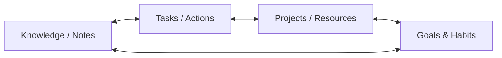

* **Knowledge to Action:** A task can be connected to the knowledge required to complete it, while a piece of knowledge can generate a task.
* **Unified Project Scope:** A project can contain tasks, resources, people, concepts, decisions, and goals.
* **Goal Alignment:** A habit can be connected to the goals it supports, and a study topic can connect to notes, sources, exercises, deadlines, and projects.

The result is a **unified system** in which knowledge and action exist in the same structure.

---

## 2. The Problem

Digital life has created an unusual paradox: we have access to more information, tools, and opportunities than any previous generation, yet managing them has become increasingly difficult.

People constantly encounter:

* Articles they want to read
* Videos they want to watch
* Books they want to study
* Ideas they want to explore
* Projects they want to build
* Skills they want to learn
* Tasks they need to complete
* Habits they want to establish
* Goals they want to achieve
* Places they want to visit
* Products they want to buy
* Information they want to remember

Much of this information is saved somewhere—split across disjointed silos:

| Storage Location | Disconnection Risk |
| :--- | :--- |
| **Browser Bookmarks** | Saved link lost among hundreds of unvisited URLs. |
| **Notes Apps** | Useful context forgotten because it's detached from the project. |
| **Screenshots & Photos** | Visual info with zero metadata or queryability. |
| **Browser Open Tabs** | Resource hogs causing cognitive overload. |
| **Task Managers** | Execution steps missing the reference material to execute. |
| **Messaging Apps** | Shared ideas buried in chat history. |
| **Human Memory** | High decay rate and cognitive strain. |

Eventually, the connections between these pieces of information disappear:
* A saved article may have been relevant to a project, but that relationship is forgotten.
* A task may require information that exists in another application.
* A useful note may never be revisited because it is disconnected from the context in which it matters.
* A goal may exist without a concrete plan.
* A plan may exist without the knowledge required to execute it.

> [!IMPORTANT]
> **The Core Problem:**
> *People do not merely have too much information. They have too much disconnected information.*

---

## 3. The Central Idea

Centrode is built around a simple principle:

> [!TIP]
> **The Core Principle:**
> *Your life is a network of interconnected things, so your software should represent it as one.*

Instead of forcing information into isolated categories (such as Notes, Tasks, Projects, Bookmarks, Goals, Habits, Resources, Contacts), Centrode represents them as different types of entities within a **common graph**.

### Example: Interconnected Project Node

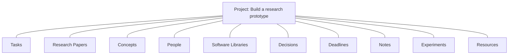

The user can navigate this information spatially like a mind map while retaining the deeper structure and relationships of a property graph.

$$ \text{System Power} = \text{Graph Flexibility} + \text{Mind-Map Speed} + \text{Task Management} + \text{Knowledge Management} + \text{Logical Workflows} $$

---

## 4. Primary Goals

### 4.1 Create a Central Hub for Life
Centrode should become a single environment where users can manage all key components of their lives without worrying about which app each piece of information belongs in:

* **Work & Education:** Academic studies, research papers, projects.
* **Execution:** Tasks, planning, personal projects, milestones.
* **Self-Improvement:** Habits, goals, learning roadmaps.
* **Knowledge Repository:** Notes, concepts, resources, personal interests.

---

### 4.2 Preserve Context
Information is significantly more useful when its relationships are preserved. Instead of merely storing `"Learn Rust"`, Centrode allows the user to preserve the surrounding intent and context:

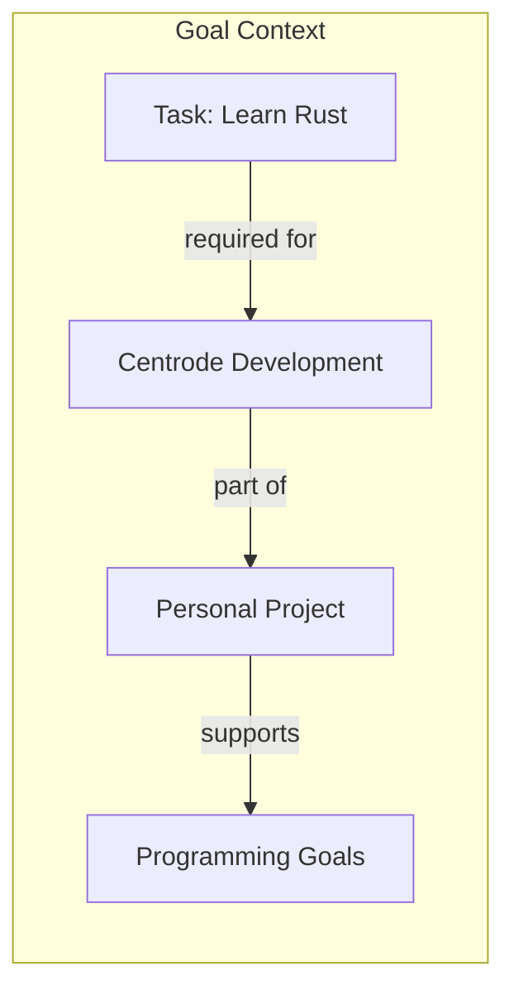

Likewise for conceptual notes:

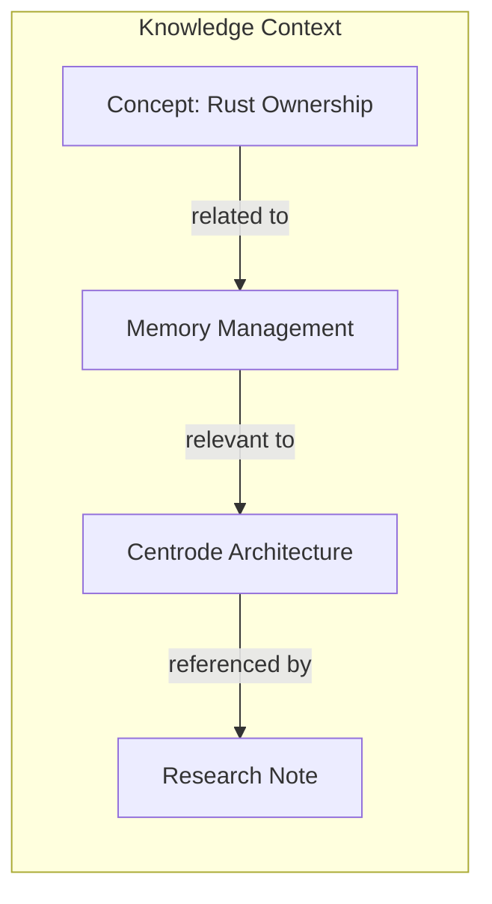

The relationship itself becomes valuable information.

---

### 4.3 Convert Knowledge Into Action
Knowledge management and task management are normally treated as separate activities. Centrode treats them as two sides of the same system.

#### Knowledge Generating Action
1. **Knowledge Node:** `"Learn A* pathfinding"` *(contains notes & resources)*
2. **Generated Task:** `"Implement A* prototype"`
3. **Subsequent Action:** `"Benchmark A* against alternative routing algorithms"`

#### Action Requiring Knowledge
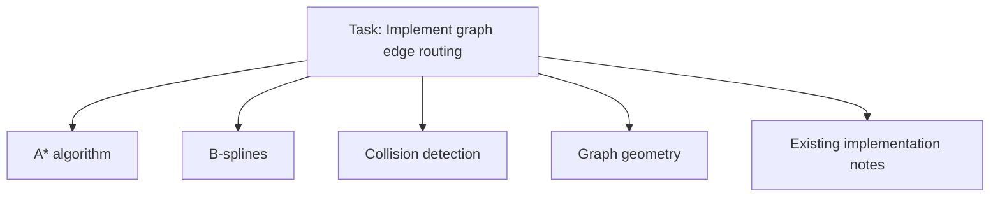

This creates a continuous, dynamic loop between what you know and what you do.

---

## 5. Core Data Model

The underlying architecture of Centrode is a **labeled property graph**.

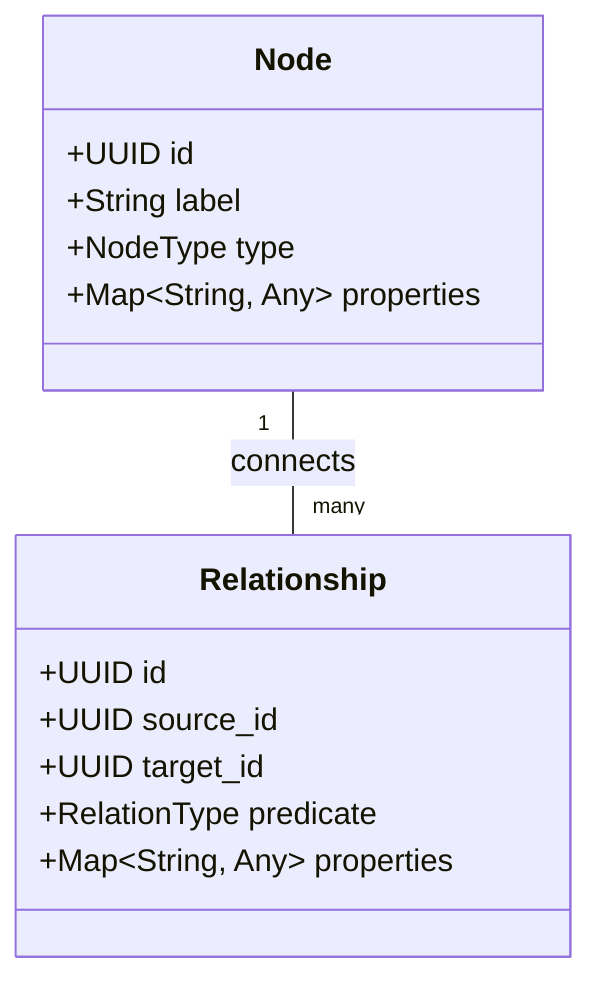

### Key Elements

#### 1. Nodes
Nodes represent entities or pieces of information. A node can have arbitrary properties appropriate to its type.
* **Entity Types:** Person, Task, Project, Note, Concept, Resource, Goal, Habit, Event, Location, Book, Article, Idea.

#### 2. Relationships
Relationships connect nodes and explicitly describe how they relate. Relationships may themselves contain properties.
* **Predicates:** `requires`, `supports`, `depends_on`, `part_of`, `related_to`, `created_by`, `references`, `blocks`, `derived_from`, `causes`, `contradicts`.

This graph model is substantially more expressive than a conventional rigid folder hierarchy.

### 5.3 Soft Forced Ontology & Dictionaries

In an unconstrained graph, flexibility can devolve into semantic fragmentation—users create duplicate concepts under slightly different labels (`start` vs `beginning`, `depends_on` vs `requires`).

Centrode resolves this through a **Soft Forced Ontology**:

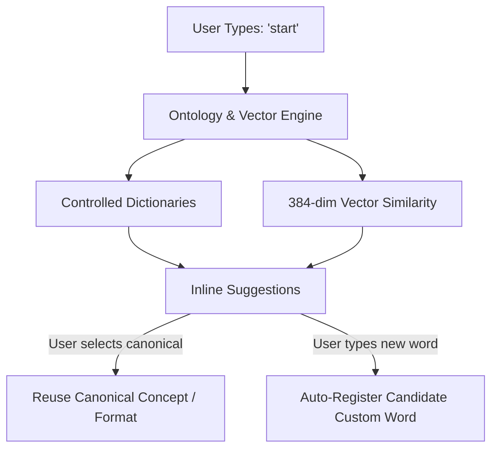

1. **Non-Blocking ("Soft") Guidance**: Capture remains fast and unhindered. The user is never blocked by rigid schema modals.
2. **Controlled Dictionaries & Visual Sync**:
   * **Relation Predicate Dictionary**: Selecting relation verbs (e.g. `contradicts`) automatically formats edge geometry and endpoint shapes (e.g. inward-pointing arrows).
   * **Custom Vocabulary**: Unrecognized domain terms and acronyms are implicitly tracked and validated during map spelling audits.
3. **Pure Graph Compound Classes**: "Class properties" are not hidden key-value forms; attributes are themselves **nodes connected via relations** (e.g. `[Book] --(written_by)--> [Person]`).
4. **Vector Space Intelligence**: Continuous 384-dimensional vector embeddings run locally in pure Rust, enabling semantic similarity matching without manual synonym lists.

---

## 6. Mind-Map Interface

Although the underlying data model is a graph, Centrode does not require users to think like database engineers. The interface provides the immediacy of a mind map.

### Key Interaction Features
* ⚡ **Rapid Node Creation:** Capture ideas instantly without setup overhead.
* 🔗 **Minimal Interaction Connecting:** Link items visually with simple gestures.
* 🗺️ **Spatial Arrangement:** Organize elements freely across an infinite canvas.
* 📂 **Expand & Collapse Branches:** Focus on active areas while suppressing noise.
* 👁️ **Visual Relationship Navigation:** Traverse complex networks effortlessly.
* 🔄 **Flexible Representations:** Toggle seamlessly between spatial maps and structured list views.

> **Goal:** Combine the low cognitive friction of mind mapping with the structural power of property graphs.

---

## 7. Notes and Knowledge

Notes are not isolated documents. A note exists as a node within the user's larger information network.

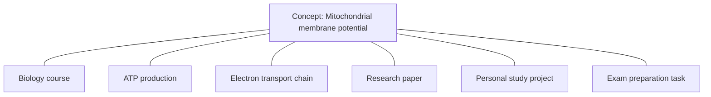

This structural connection allows notes to accumulate context over time instead of becoming an increasingly difficult archive to search.

---

## 8. Task Management

Centrode integrates task management directly into the graph rather than keeping it in a separate silo.

### Task Attributes
* **Metadata:** Status, Priority, Deadline, Recurrence.
* **Graph Connections:** Dependencies, Parent project, Required knowledge, Associated resources, Related goals, Related habits.

### Multi-Context Task Placement
A single task can exist at the intersection of multiple areas without duplication:

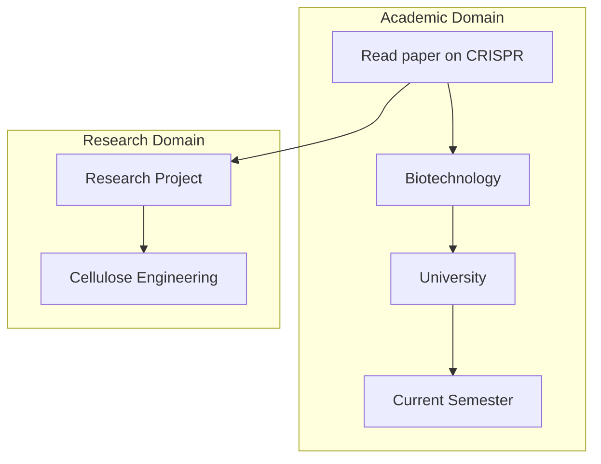

---

## 9. Projects

Projects are collections of interconnected entities rather than merely folders containing tasks.

### Project Composition
A single project node can connect to Objectives, Tasks, Knowledge, Resources, People, Decisions, Milestones, Deadlines, Notes, and Subprojects.

### Dynamic Project Views
Depending on current focus, a user can view a project as:
1. 📋 **Task List** — focused on pending execution items.
2. 🧠 **Mind Map** — focused on spatial brainstorming.
3. 🕸️ **Knowledge Graph** — focused on relational concepts.
4. 📅 **Timeline** — focused on milestones and deadlines.
5. 📝 **Collection of Notes** — focused on documentation and research.

---

## 10. Goals and Habits

Centrode extends graph modeling to personal development and habit tracking.

### Goal Context Network
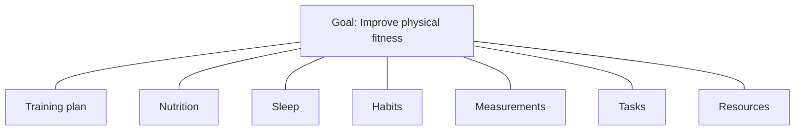

### Habit Alignment Chain
Rather than living as an isolated checkbox, habits connect directly to broader objectives:

$$\text{Habit: Study 45 mins daily} \xrightarrow{\text{supports}} \text{Goal: Improve academic performance} \xrightarrow{\text{contributes to}} \text{Degree}$$

---

## 11. Logical Gates and Data Flows

Centrode introduces logical relationships and information flows directly into the graph network, moving beyond static visualization into a **programmable personal workflow environment**.

### Supported Logic Structures
* `AND` / `OR` / `NOT` gates
* Conditional relationships
* Dependency gates
* Trigger conditions
* Sequential flows

### Execution Flow Examples

#### AND Gate (Dependency Unlock)
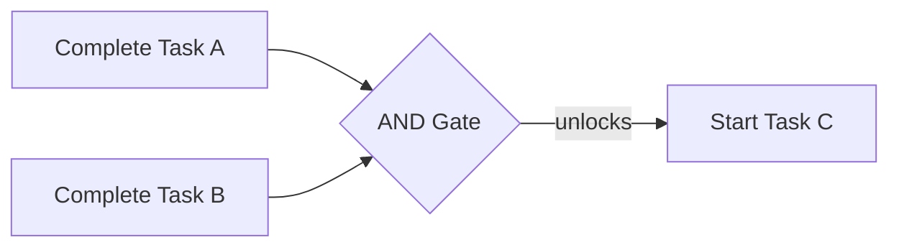

#### OR Gate (Trigger Condition)
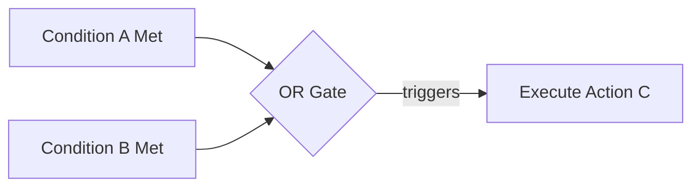

---

## 12. Artificial Intelligence as a Graph Companion

Most software treats Artificial Intelligence as an external chatbot—a text box residing in a side panel, isolated from the workspace where thought actually occurs. The user is forced to copy information into a prompt box and paste the AI's response back into their notes. Context is broken at every step.

Centrode treats AI as a **native participant within the graph**.

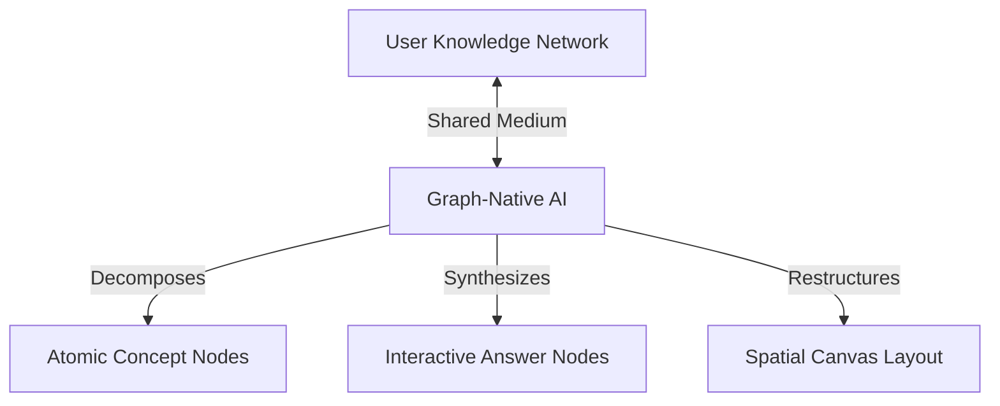

### 12.1 Co-Thinking in the Shared Medium
The AI interacts with the graph through the same underlying representation as the user. It reads node properties, understands relationship predicates, and can mutate or restructure the graph directly. 

* **Cognitive Decomposition:** When a user encounters a dense or complex node, the AI can break it down into an interconnected network of simpler, atomic concepts—reducing cognitive load without losing context.
* **User-Defined Reasoning Context:** Instead of feeding an entire database to the model, the user explicitly designates specific nodes or branches to serve as the AI's active reasoning context. 
* **In-Situ Learning:** Exploration and questioning occur directly inside the canvas where the user's notes, tasks, and resources reside. The AI's responses are instantiated as interactive graph nodes, integrating newly synthesized knowledge into the user's ongoing work immediately.

---

## 13. Frictionless Capture and the Mobile Mind

An idea, task, or realization often occurs in transit—away from a primary workstation. The friction of opening a heavy application, navigating to a folder, and deciding where an item belongs is frequently enough to cause the thought to be lost.

Centrode treats capture as an **unconditional, low-friction event**.

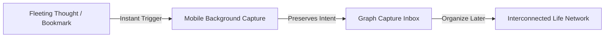

On mobile devices, a lightweight background service allows the user to capture notes, tasks, bookmarks, or audio thoughts instantly via system quick actions or voice commands. 

The user is never forced to categorize or organize at the moment of capture. The system preserves the raw thought immediately, allowing it to be linked into the larger personal network when the user is ready to reflect and organize.

---

## 14. Extensibility: Software as an Evolving Medium

No single application designer can anticipate every individual's mental model or domain-specific workflow. Rigid software forces users to adapt their thinking to the constraints of the tool.

Centrode is designed as an **open, extensible substrate**.

Through a WebAssembly (Wasm) plugin engine, developers and users can introduce custom logic, specialized node behaviors, automated workflows, and tailored spatial visualizations into the graph. 

Because plugins run inside a sandboxed WebAssembly environment, extensibility does not come at the expense of system security or performance. The tool can grow and evolve alongside the unique ways different individuals think, research, and build.

---

## 15. Beyond the Folder Hierarchy: Graph-Based File Storage

For decades, operating systems have organized files into rigid, hierarchical folder trees. A file must live in one folder, within one path, under one parent directory.

Yet human thoughts and projects rarely conform to strict tree hierarchies. A research document may simultaneously relate to an active project, a long-term learning goal, a budget, and several personal notes.

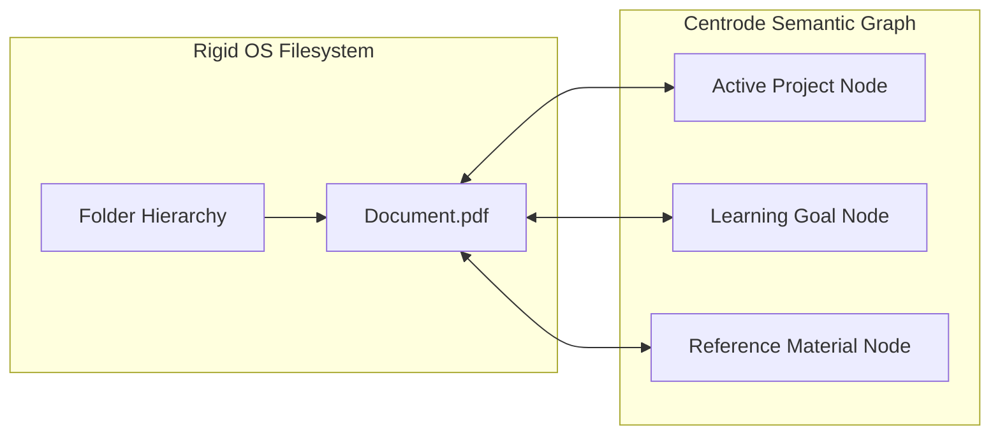

Centrode bridges physical disk storage with semantic graph representation:

* **Semantic Indexing:** Files and directories on the local hard drive can be indexed directly as graph nodes, assigning them rich semantic connections without moving them from their physical disk location.
* **Multi-Context Belonging:** A single file can exist at the intersection of multiple projects, ideas, and goals without file duplication.
* **Seamless Navigation:** The graph acts as an intelligent file explorer. Interacting with an indexed file node opens it instantly—either within Centrode's contextual views or in the operating system's native environment.

Information is no longer defined merely by *where it is stored on disk*, but by *what it means and how it connects to your life*.

---

## 16. Information → Knowledge → Action

A primary conceptual goal of Centrode is establishing a clear pipeline from information consumption to execution:

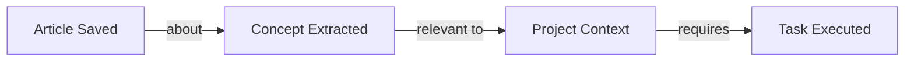

This transforms Centrode from a passive information storage system into an active **Information-to-Action System**.

---

## 17. Solving the "Forgotten Information" Problem

Centrode shifts how users retrieve and leverage saved information through graph relationship queries:

| Traditional Paradigm | Centrode Graph Paradigm |
| :--- | :--- |
| *"Where did I save that file?"* | *"What information do I have saved about this concept?"* |
| *"Which folder has my notes?"* | *"What resources are relevant to this active project?"* |
| *"What was I working on last month?"* | *"What unfinished ideas connect to what I'm doing now?"* |

Information becomes naturally discoverable through its relationships rather than reliant on manual folder indexing.

---

## 18. Reducing Cognitive Fragmentation

Centrode's ultimate goal is to align digital organization with human cognitive reality.

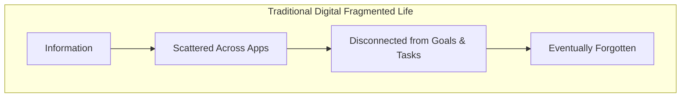

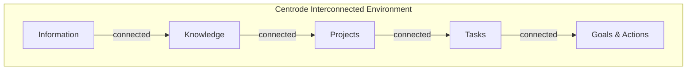

---

## 19. Product Philosophy

Centrode is guided by six fundamental principles:

1. **Connections over Containers**
   * Folders organize information by location; graphs organize information by relationships. Prioritize connections.
2. **Context over Isolated Data**
   * A piece of information becomes exponentially more valuable as its surrounding context grows.
3. **Capture Should Be Fast**
   * Never force the user to construct a perfect organizational structure before recording an idea. Capture first; organize and connect later.
4. **Structure Should Emerge Naturally**
   * Allow users to gradually develop sophisticated networks without requiring upfront database design.
5. **Knowledge and Action Should Coexist**
   * Notes should easily become tasks; tasks should expose knowledge requirements; projects should tie both together.
6. **Complexity Should Remain Optional**
   * Keep basic interaction as frictionless as creating and connecting nodes, while allowing advanced graph capabilities under the hood.

---

## 20. Long-Term Vision

Centrode aims to evolve beyond a simple productivity tool into a **personal operating system for information, planning, and action**.

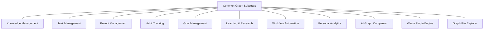

Because all capabilities operate on the same underlying graph, new features do not require isolated database tables or siloed user interfaces—they simply introduce new node types, relationship predicates, properties, or logical operations.

---

## 21. The Core Vision & Brand Positioning

### Core Statement

> [!CAUTION]
> **The Problem:**
> *Modern life gives us more information and possibilities than we can organize, remember, and act upon.*

> [!NOTE]
> **Centrode's Answer:**
> *Give everything a place, give everything context, and connect everything that matters.*

Centrode is not fundamentally a notes app, a task manager, or a mind mapper. It is a **connected environment for managing everything that makes up a person's life**.

---

### Brand Positioning

> ### **Centrode**
> **The Central Hub for Your Life.**
>
> *Because your life isn't scattered. Your tools are.*

*— Or (Action-Oriented):*

> ### **Centrode**
> **The Central Hub for Your Life.**
>
> *Stop collecting information. Start connecting it.*
