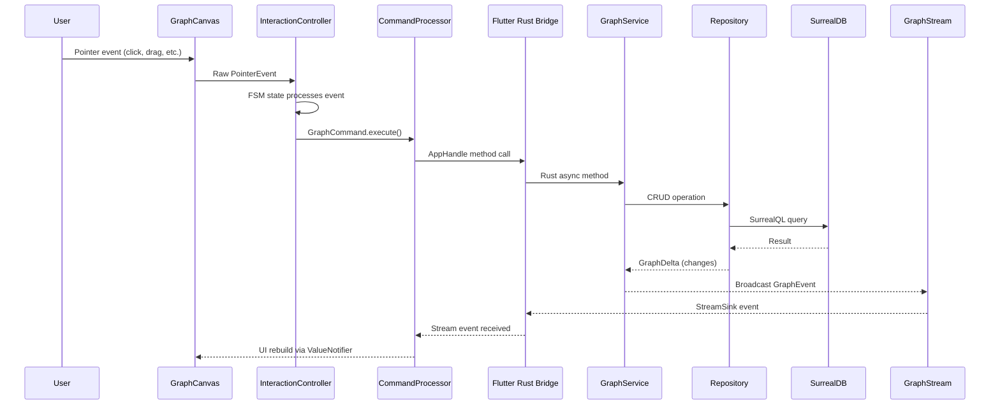
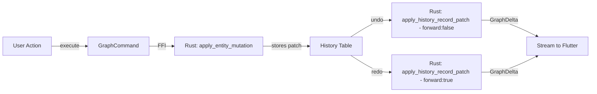

# Data Flow

This document traces how data flows from user input through the Flutter frontend, across the FFI bridge, into the Rust backend, and back.

---

## Request Flow (User Action → Persistence → UI Update)



---

## Command Pipeline

All mutations go through the command pattern:

1. **User interaction** → Interaction FSM determines intent
2. **Command created** → e.g., `CreateNodeCommand`, `MoveNodeCommand`
3. **Command.execute()** → calls `GraphApi` method → FFI call to Rust
4. **Rust processes** → `GraphService` → `Repository` → SurrealDB
5. **Rust emits delta** → `GraphEvent` via `StreamSink`
6. **Dart receives delta** → `GraphSyncEngine` applies changes to local state
7. **UI rebuilds** → `ValueNotifier` listeners trigger repaint

---

## Stream Events

Rust broadcasts graph changes back to Flutter via `GraphEvent`:

```rust
pub enum GraphEvent {
    Delta(GraphDelta),     // Node/relation mutations
    Boundaries(BoundingBox), // Content boundary updates
    Error(String),         // Error notifications
}
```

The `GraphSyncEngine` in Dart processes these events and updates the local `ValueNotifier` tree, which triggers UI rebuilds.

---

## Sync Engine

`lib/features/graph/store/modules/graph_sync_engine.dart` is the bridge between Rust streams and Dart state:

- Subscribes to `GraphEvent` stream from Rust
- Applies `GraphDelta` to local node/relation maps
- Updates `ValueNotifier` instances that widgets listen to
- Handles boundary recalculation after mutations

---

## Undo/Redo Flow



Each mutation creates a `SymmetricEntityPatch` stored in the `History` table. Undo reverses the patch; redo re-applies it. The same `GraphDelta` stream mechanism propagates changes back to the UI.

---

## Key Types in the Pipeline

| Layer | Type | Location |
|-------|------|----------|
| Dart UI | `UiNode` (sealed class) | `lib/features/graph/models/graph_node.dart` |
| Dart Command | `GraphCommand` (abstract) | `lib/features/graph/models/commands/base.dart` |
| Dart API | `GraphApi` (abstract) | `lib/features/graph/store/graph_api.dart` |
| FFI Boundary | `AppHandle` | `rust/src/bridge/api.rs` |
| Rust Service | `GraphService` | `rust/src/services/graph_service.rs` |
| Rust Domain | `Nodes` (enum) | `rust/src/domain/nodes.rs` |
| Rust Persistence | `Repository` | `rust/src/persistence/repo.rs` |
| Rust Stream | `GraphEvent` | `rust/src/bridge/stream.rs` |
