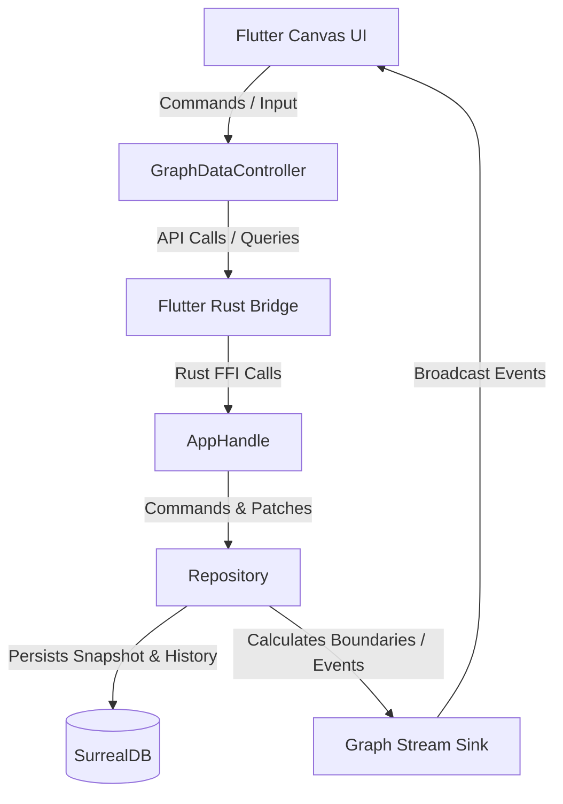

# Architecture Overview

Centrode is a bilingual Flutter + Rust application: a canvas-based visual knowledge graph with SurrealDB backend via Flutter Rust Bridge (FRB v2).

---

## System Diagram

---

## Module Map

### Flutter Frontend (`lib/`)

| Module | Path | Responsibility |
|--------|------|----------------|
| **Graph** | `lib/features/graph/` | Core feature — canvas, node editing, routing, store |
| **Workspace** | `lib/features/workspace/` | Project/map management hub |
| **Infrastructure** | `lib/infrastructure/` | Telemetry, logging, error handling |
| **Presentation** | `lib/presentation/` | Theme system, shared presentation widgets |
| **Shared** | `lib/shared/` | Common widgets, glass panel, utilities |

### Rust Backend (`rust/src/`)

| Module | Path | Responsibility |
|--------|------|----------------|
| **Bridge** | `rust/src/bridge/` | FFI endpoints exposed to Flutter |
| **Domain** | `rust/src/domain/` | Core types: nodes, relations, patches, styles |
| **Persistence** | `rust/src/persistence/` | SurrealDB connection, CRUD, history, schema |
| **Relation Engine** | `rust/src/relation_engine/` | Routing algorithms, path finding, composition |
| **Layout Engine** | `rust/src/layout_engine/` | Force-directed graph layout, physics forces |
| **Services** | `rust/src/services/` | High-level graph service layer, asset vault |
| **Format** | `rust/src/format/` | `.cent` zip package format |
| **Telemetry** | `rust/src/telemetry.rs` | Tracing subscriber bridged to Flutter |

---

## Boot Sequence

1. `lib/main.dart` — `WidgetsFlutterBinding.ensureInitialized()`
2. Window manager setup (desktop platforms)
3. `RustLib.init()` — load FRB native library, initialize Rust side
4. `LogManager().init()` — set up Dart-side logging
5. `GlassShaderProvider.load()` — compile liquid glass GLSL shader
6. `AppPaths.ensureDirectories()` — create data directories
7. `ThemeLoader.loadBundledThemes()` — load JSON themes from `assets/themes/`
8. `runApp(MyApp)` — start Flutter app with `WorkspaceHubScreen` as home

On the Rust side, `init_core()` (called via FRB init) sets up the `tracing` telemetry subscriber.

---

## Key Entry Points

| File | Role |
|------|------|
| `lib/main.dart` | App entry — boots Rust FFI, loads themes |
| `lib/features/workspace/ui/workspace_hub_screen.dart` | Home screen — map/project selector |
| `lib/features/graph/ui/graph_screen.dart` | Graph editor — main canvas scaffold |
| `lib/features/graph/ui/canvas/graph_canvas.dart` | Infinite canvas — core interaction + rendering |
| `lib/features/graph/store/graph_api.dart` | Store API — data access facade |
| `lib/features/graph/store/modules/graph_sync_engine.dart` | Sync engine — Rust FFI sync bridge |
| `rust/src/bridge/api.rs` | FFI API surface — all endpoints callable from Flutter |
| `rust/src/persistence/repo.rs` | Repository — SurrealDB CRUD layer |
| `rust/src/relation_engine/engine.rs` | Relation engine — routing + geometry |
| `rust/src/layout_engine/engine.rs` | Layout engine — force-directed graph layout & OptArea physics |

---

## Cross-Cutting Concerns

- **Continuous Infinite Zoom**: Nested container hierarchy with world-space coordinate resolution and boundary expansion
- **Undo/Redo**: Symmetric entity patches stored in SurrealDB `History` table, applied via `apply_history_record_patch`
- **Dynamic Snap & Routing**: Dynamic port alignment, snap guidelines, and live relation rerouting during dragging
- **Bounded Layout Optimization (OptArea)**: Sub-graph physics layout constrained to user-defined rectangular optimization regions
- **File Attachments**: Content-addressable asset vault (SHA-256 CAS), multi-attachment support on InfoNode/TaskNode, singular on MediaNode
- **Streaming**: Rust broadcasts `GraphEvent` to Flutter via FRB `StreamSink`, enabling real-time UI updates
- **Telemetry**: Rust `tracing` → `TelemetryLayer` → FFI stream → Dart `LogManager`
- **Themes**: JSON files in `assets/themes/` → `AppTheme` objects → `AppThemeManager` → `ValueListenableBuilder`

---

## Platform Support

| Platform | Status |
|----------|--------|
| Windows | Primary development target |
| Linux | Supported |
| macOS | Supported |
| Android | Supported |
| iOS | Not configured |
| Web | Not supported (native Rust required) |
