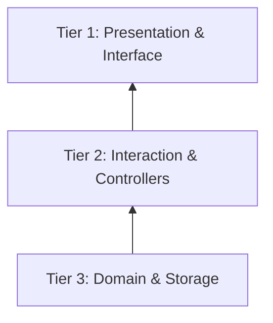

# Tier System

Centrode enforces a strict 3-tier layering architecture. Lower tiers must never import from higher tiers.

---

## Tier Definitions

### Tier 1 — Presentation & Interface

**Responsibility**: Rendering, layout, visual representation only.

| Path | Contents |
|------|----------|
| `lib/features/graph/ui/` | Canvas widgets, paint layers, node renderers, overlays |
| `lib/features/graph/ui/canvas/painters/` | Custom painters for nodes, relations, grid |
| `lib/features/graph/ui/canvas/layers/` | Layered painting pipeline (grid, node, relation, port, overlay) |
| `lib/features/graph/ui/widgets/` | Sidebars, toolbars, status bar, inspectors |
| `lib/features/workspace/ui/` | Workspace hub screen and widgets |
| `lib/shared/widgets/` | Shared UI elements (glass panel, buttons, etc.) |
| `lib/presentation/widgets/` | Theme-aware widgets |

**Rules**:
- Must NOT make direct database queries or writes
- Must emit events or commands to Tier 2 coordinators
- Must NOT import from `store/`, `models/commands/`, `domain/`, or `rust/src/`

### Tier 2 — Interaction & Controllers

**Responsibility**: Transient state, coordination, user intent processing.

| Path | Contents |
|------|----------|
| `lib/features/graph/engine/` | Interaction FSM, gesture handling, hit testing, facades |
| `lib/features/graph/engine/states/` | 11 interaction states (idle, drag, resize, marquee, frame/optarea draw, etc.) + 2 utilities |
| `lib/features/graph/presentation/` | View state, viewport, selection, style managers |
| `lib/features/graph/presentation/handlers/` | Action handlers (content, spatial, topology) |
| `lib/features/graph/presentation/strategies/` | Layout, style, container zoom, and text strategies |
| `lib/features/graph/models/commands/` | Command implementations (18 commands, 3 base/support files) |

**Rules**:
- Must NOT import from Tier 1 (`ui/` widgets)
- May import from Tier 3 (domain, persistence)
- Coordinates between UI events and data mutations

### Tier 3 — Domain & Storage

**Responsibility**: Business logic, data persistence, core domain types.

| Path | Contents |
|------|----------|
| `lib/features/graph/store/` | GraphApi interface, query controller, command processors, spatial index |
| `lib/features/graph/store/modules/` | 12 store mutation modules and `GraphSyncEngine` |
| `lib/features/graph/models/` | UiNode types, relation models, DTOs |
| `rust/src/domain/` | Core Rust types: nodes, relations, patches, styles |
| `rust/src/persistence/` | SurrealDB connection, CRUD, history, schema |
| `rust/src/relation_engine/` | Routing algorithms, path finding |
| `rust/src/layout_engine/` | Force-directed layout, physics |
| `rust/src/services/` | High-level graph service |

**Rules**:
- Must NEVER import from Tier 1 or Tier 2
- This is the "core" — changes here have the widest blast radius
- Domain types are shared across Dart and Rust via FRB bindings

---

## Boundary Enforcement

The architectural bounds are enforced by convention and code review. Key violations to watch for:

| Violation | Example | Fix |
|-----------|---------|-----|
| UI → DB direct query | `Repository().getNode(id)` in a widget | Route through `GraphApi` → command |
| Domain → UI import | `import '../ui/widgets/...'` in store module | Remove dependency, emit event instead |
| Command → Widget | Command directly updates a `ValueNotifier` on a widget | Use store mutation + stream |

---

## Barrel Export Convention

Each module uses a barrel `export` file:
- `lib/features/graph/models/models.dart` — exports all model files
- `lib/features/graph/models/commands.dart` — exports all command files
- `lib/features/graph/presentation/handlers/handlers.dart` — exports all handlers

These barrel files are the public API surface of each module. Import only from barrels, never from individual files outside the module.
