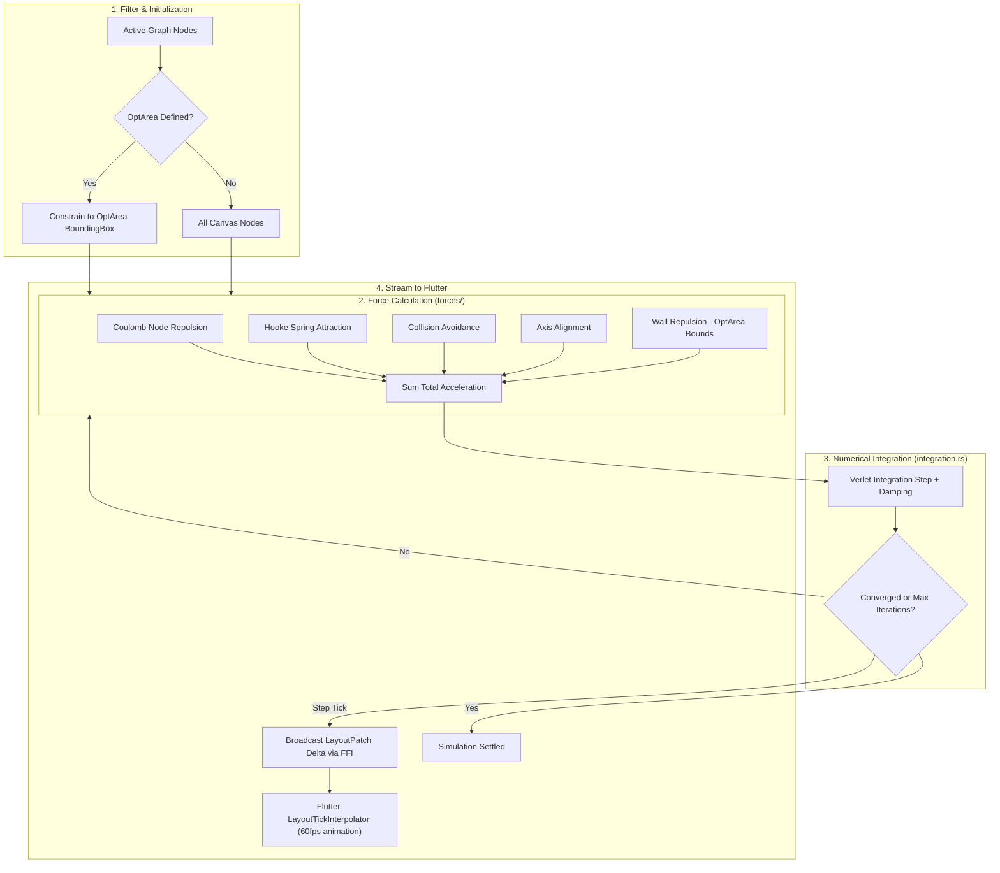

# Layout Engine

---

## Overview

The layout engine implements force-directed graph layout using physics simulation. It positions nodes based on attractive and repulsive forces.

---

## Core Files

| File | Role |
|------|------|
| `engine.rs` | Main `LayoutEngine` — runs simulation |
| `config.rs` | `LayoutConfig` — force parameters |
| `state.rs` | Layout state (node positions, velocities) |
| `types.rs` | Layout types |
| `integration.rs` | Verlet integration (position update) |
| `port_optimizer.rs` | Port placement optimizer |

---

## Forces (`forces/`)

| Force | File | Description |
|-------|------|-------------|
| Repulsion | `repulsion.rs` | Coulomb repulsion between nodes |
| Attraction | `attraction.rs` | Spring attraction between connected nodes |
| Collision | `collision.rs` | Node-node collision avoidance |
| Alignment | `alignment.rs` | Axis alignment force |
| Anchor | `anchor.rs` | Anchor spring (pin nodes to position) |
| Density | `density.rs` | Density-based spacing |
| Node-Edge | `node_edge.rs` | Node-edge repulsion |
| Wall | `wall.rs` | Boundary wall repulsion |

---

## Simulation Pipeline

---

## Physics Model

The engine uses **Verlet integration** for stable position updates:

1. Compute all forces on each node
2. Sum forces → acceleration
3. Update velocity (with damping)
4. Update position via Verlet integration
5. Apply boundary constraints

### Force Types

- **Repulsion**: Nodes push each other away (Coulomb's law)
- **Attraction**: Connected nodes pull toward each other (Hooke's law)
- **Collision**: Prevents node overlap
- **Alignment**: Snaps nodes to axes
- **Anchor**: Pins specific nodes to target positions

---

## Configuration

`LayoutConfig` controls:
- `repulsion_strength`: Coulomb constant
- `attraction_strength`: Spring constant
- `damping`: Velocity damping factor
- `max_iterations`: Simulation step limit
- `convergence_threshold`: When to stop

---

## Port Optimizer

`port_optimizer.rs` determines optimal port placement for relations:
- Minimizes edge crossings
- Balances port distribution on node boundaries
- Considers routing mode constraints

---

## Optimization Area (OptArea)

The Layout Engine supports **Optimization Areas** (`BoundingBox`) which constrain force-directed simulations to a localized region:

- **Bounded Physics**: Forces are computed strictly for nodes inside the active `OptArea`.
- **Soft/Hard Wall Repulsion**: Nodes reaching the `OptArea` bounding box experience boundary wall repulsive forces (`forces/wall.rs`) preventing drift outside the active region.
- **Frontend Interaction**: Activated via `OptAreaDraw` and `OptAreaResize` interaction states, communicating with Rust via `set_opt_area` and `get_opt_area` FFI endpoints.
- **Tick Interpolation**: Positions stream to Flutter via layout patches, interpolated on the frontend by `LayoutTickInterpolator` (`lib/features/graph/store/modules/layout_tick_interpolator.dart`) for 60fps smooth visual settling.
