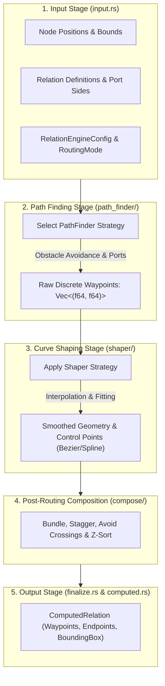

# Relation Engine

---

## Overview

The relation engine computes visual paths for connections between nodes. It handles routing, path finding, shaping, and post-routing composition.

---

## Core Files

| File | Role |
|------|------|
| `engine.rs` | Main `RelationEngine` — orchestrates the pipeline |
| `computed.rs` | `ComputedRelation` — output type with path data |
| `config.rs` | `RelationEngineConfig`, `RoutingMode` |
| `state.rs` | Engine state management |
| `strategy.rs` | Strategy pattern dispatch |
| `types.rs` | Engine types |
| `input.rs` | Input processing |
| `geometry.rs` | Geometry primitives |
| `geometry_utils.rs` | Geometry utilities |
| `endpoint_shapes.rs` | Arrow/marker endpoint rendering |
| `finalize.rs` | Finalization pass |

---

## Execution Pipeline

---

## Path Finders (`path_finder/`)

| Algorithm | File | Description |
|-----------|------|-------------|
| Core | `core.rs` | Core pathfinding logic |
| Grid | `grid.rs` | Grid-based obstacle avoidance |
| Octilinear | `octilinear.rs` | Manhattan-distance routing |
| Orthogonal | `orthogonal.rs` | Right-angle routing |
| B-spline | `bspline.rs` | B-spline path generation |
| Port | `port.rs` | Port-based routing |
| Simplify | `simplify.rs` | Path simplification |
| Steer | `steer.rs` | Obstacle steering |

---

## Shapers (`shaper/`)

Convert waypoints into smooth curves:

| Strategy | File | Description |
|----------|------|-------------|
| Bezier | `bezier.rs` | Cubic Bezier curves |
| B-spline | `bspline.rs` | B-spline smoothing |
| Octilinear | `octilinear.rs` | Octilinear path shaping |
| Orthogonal | `orthogonal.rs` | Orthogonal path shaping |
| Sinewave | `sinewave.rs` | Sinusoidal wave paths |
| Straight | `straight.rs` | Straight lines |
| Simplify | `simplify.rs` | Path point reduction |
| Core | `core.rs` | Core shaper logic |

---

## Composers (`compose/`)

Post-routing adjustments:

| Composer | File | Description |
|----------|------|-------------|
| Bundle | `bundle.rs` | Multi-edge bundling |
| Crossing | `crossing.rs` | Crossing minimization |
| Nudge | `nudge.rs` | Endpoint nudging |
| Stagger | `stagger.rs` | Parallel edge staggering |
| Z-order | `zorder.rs` | Z-order sorting |

---

## Routing Modes

`RoutingMode` enum selects the routing algorithm:
- `Bezier` — dynamic Bezier routing around obstacles
- `Orthogonal` — right-angle routing
- `Octilinear` — Manhattan-distance routing
- `Straight` — direct lines

---

## Output

`ComputedRelation` contains:
- `path`: Vec of (x, y) waypoints
- `start_point` / `end_point`: Connection endpoints
- `control_points`: Bezier control points (if applicable)
- `bounding_box`: Path bounding rectangle
- `crossings`: Detected crossing points
