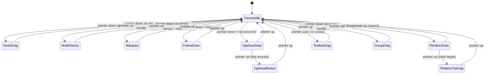

# Interaction Engine

---

## Overview

The interaction engine is a finite state machine (FSM) that processes raw `PointerEvent`s directly, bypassing Flutter's Gesture Arena. This gives Centrode full control over gesture interpretation in canvas space.

**Key design**: GoF State Pattern with sealed class + exhaustive pattern matching.

---

## Core Files

| File | Role |
|------|------|
| `engine/interaction_engine.dart` | `InteractionController` — FSM host, event dispatcher |
| `engine/base_interaction_state.dart` | `CanvasInteractionState` — sealed base class |
| `engine/interaction_context.dart` | `InteractionContext` — environment injected into states |
| `engine/hit_test_resolver.dart` | Hit testing — determines what's under the pointer |
| `engine/gesture_interceptor.dart` | Interceptor pattern for custom gesture handling |
| `engine/drawing_interceptor.dart` | Drawing-specific gesture interception |
| `engine/volatile_node_state.dart` | Transient node state during interactions |
| `engine/z_order_utils.dart` | Z-order sorting for hit testing |
| `engine/config.dart` | Engine configuration constants (includes elastic/spring params) |
| `engine/canvas_tool_mode.dart` | `CanvasToolMode` enum — active canvas tool (select, frame, opt area, ...) |
| `engine/interaction_facade.dart` | Facade bridging states to store & action handlers (see below) |

---

## State Diagram



---

## States & Utilities

The `states/` directory contains **11 concrete FSM states** and **2 helper utility managers**:

### 11 FSM States
| State | File | Behavior |
|-------|------|----------|
| `CanvasIdle` | `states/idle_state.dart` | Default state — pan, hover, double-click to edit |
| `NodeDrag` | `states/node_drag_state.dart` | Dragging selected nodes with live snap & dynamic relation rerouting |
| `GroupDrag` | `states/group_drag_state.dart` | Dragging entire group of nodes |
| `NodeResize` | `states/node_resize_state.dart` | Resizing node dimensions |
| `Marquee` | `states/marquee_state.dart` | Selection rectangle (shift+drag) |
| `FrameDraw` | `states/frame_draw_state.dart` | Drawing new frame nodes |
| `OptAreaDraw` | `states/opt_area_draw_state.dart` | Drawing layout optimization area |
| `OptAreaResize` | `states/opt_area_resize_state.dart` | Resizing optimization area bounding box |
| `RelationDraw` | `states/relation_draw_state.dart` | Drawing new relations from ports |
| `RelationTipDrag` | `states/relation_tip_drag_state.dart` | Dragging relation endpoint to new target |
| `ToolbarDrag` | `states/toolbar_drag_state.dart` | Dragging toolbar elements |

### State Utility Managers
| Utility | File | Responsibility |
|---------|------|----------------|
| `AutoPanManager` | `states/auto_pan_manager.dart` | Auto-panning when dragging near viewport edges |
| `SnapUtils` | `states/snap_utils.dart` | Grid snapping, port snapping, and guideline generation |

---

## Interaction Facade

`engine/interaction_facade.dart` implements `CanvasInteractionEnvironment` (conforming to `InteractionContext`). It decouples the state machine from concrete store, UI controllers, and action handlers (`SpatialActionHandler`, `TopologyActionHandler`, `ContentActionHandler`), allowing states to trigger operations cleanly without violating tier boundaries.

---

## Event Flow

1. `GraphCanvas` receives raw `PointerEvent` from `Listener` widget
2. Event forwarded to `InteractionController.handlePointer*()`
3. Controller converts screen coords → canvas coords via `TransformationController`
4. Current state's `handlePointer*()` method called
5. State processes event, returns next state (or `this` for no change)
6. Controller updates `state` ValueNotifier → UI reacts

---

## Gesture Interceptors

The engine supports an interceptor pattern for custom gesture handling:

```dart
controller.registerInterceptor(DrawingGestureInterceptor(...));
```

Interceptors can consume events before they reach the FSM, enabling specialized handling (e.g., drawing mode overrides default canvas gestures).
