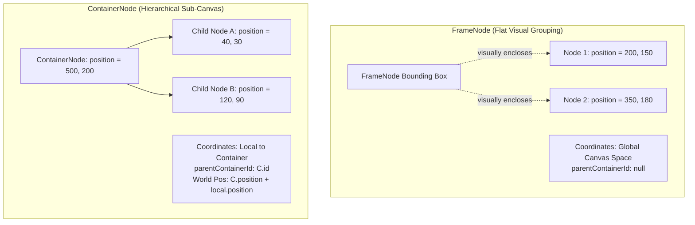

# Node Types

---

## UiNode Sealed Class

`lib/features/graph/models/graph_node.dart`

All node types extend the `UiNode` sealed class. The sealed modifier enables exhaustive pattern matching across all 9 variants.

### Base Properties (on UiNode)

| Property | Type | Description |
|----------|------|-------------|
| `id` | `RawUuid` | Unique identifier (UUID v4) |
| `position` | `Offset` | Canvas position (x, y) |
| `size` | `Size` | Width and height |
| `content` | `Content` | Rich text content (markdown blocks) |
| `layer` | `String` | Layer name (default: "default") |
| `style` | `NodeStyle?` | Custom visual style |
| `resolvedStyle` | `NodeStyle?` | Computed style after resolution |
| `layout` | `NodeLayout?` | Layout configuration |
| `parentContainerId` | `RawUuid?` | Parent container reference |
| `groupId` | `RawUuid?` | Group membership |
| `locked` | `bool` | Edit lock |
| `isExpanded` | `bool` | Expansion state (containers) |
| `significance` | `int` | Visual significance level |
| `createdAt` | `int` | Creation timestamp (millis) |
| `updatedAt` | `int` | Last update timestamp (millis) |
| `attachments` | `List<Attachment>` | File attachments (InfoNode, TaskNode only) |

---

## Node Types

### InfoNode (`InfoUiNode`)

Rich content node — the primary note-taking node. Supports markdown, tags, aliases, comments, and file attachments.

- **Rust**: `INode` in `rust/centrode_core/src/domain/nodes.rs`
- **Table**: `INode` in SurrealDB
- **Default color**: `#90CAF9` (light blue)
- **Attachments**: `Vec<Attachment>` — multi-file, content-addressable via `AssetVault`

### TaskNode (`TaskUiNode`)

Actionable item with state tracking. Has `TaskState` enum: `Todo`, `InProgress`, `Done`, `Blocked`, `Cancelled`.

- **Rust**: `TaskNode`
- **Table**: `TaskNode`
- **Default color**: `#A5D6A7` (green)
- **Attachments**: `Vec<Attachment>` — multi-file support

### FrameNode (`FrameUiNode`)

Visual boundary box for logical grouping on the canvas:
- Renders as an annotated rectangle with optional dashed outlines (`dashed_box_paint_utils.dart` / `frame_node_renderer.dart`)
- Created dynamically via `FrameDrawState` (`states/frame_draw_state.dart`)
- Nodes inside frames remain in the root canvas coordinate system
- **Rust**: `FrameNode`
- **Table**: `FrameNode`
- **Default color**: `#BCAAA4` (brown)

### ContainerNode (`ContainerUiNode`)

Hierarchical nested sub-canvas container with **True Continuous Infinite Zoom**:
- Children store positions relative to their `parentContainerId`
- World-space positions are resolved by traversing the ancestor hierarchy via `getAbsoluteWorldPosition()`
- Supports interactive expansion/collapse, boundary rendering (`container_boundary_painter.dart`), and seamless camera transitions (`ContainerZoomStrategy`)
- **Rust**: `ContainerNode`
- **Table**: `ContainerNode`
- **Default color**: `#64B5F6` (blue)

### DrawingNode (`DrawingUiNode`)

Freehand vector annotation. Stores paths as semicolon-separated coordinate strings.

- **Rust**: `DrawingNode`
- **Table**: `DrawingNode`
- **Default color**: `#CE93D8` (purple)
- **Brush types**: `Pencil`, `Highlighter`, `Eraser`, `Calligraphy`

### CommentNode (`CommentUiNode`)

Lightweight text annotation on the canvas.

- **Rust**: `CommentNode`
- **Table**: `CommentNode`
- **Default color**: `#B0BEC5` (blue grey)

### InterNode (`InterUiNode`)

Relation intersection node — represents complex multi-way connections and relationship verbs.

- **Rust**: `InterNode`
- **Table**: `InterNode`
- **Default color**: `#FFF59D` (yellow)

### ShapeNode (`ShapeUiNode`)

Geometric primitive. Has `ShapeType` enum: `Rectangle`, `Circle`, `Diamond`, `Triangle`, `Star`, `Pill`.

- **Rust**: `ShapeNode`
- **Table**: `ShapeNode`
- **Default color**: `#FFCC80` (orange)

### MediaNode (`MediaUiNode`)

Embeds external media (image, video, audio, PDF). Has `MediaType` enum: `Image`, `Video`, `Audio`, `Pdf`.

- **Rust**: `MediaNode`
- **Table**: `MediaNode`
- **Default color**: `#80CBC4` (teal)
- **Attachment**: singular `Attachment` (not a vector)

---

## UiNode ↔ Rust Mapping

The `centrode_codegen` generator creates `_$uiNodeFromRust()` which maps:
- Rust `Nodes::INode(n)` → Dart `InfoUiNode`
- Rust `Nodes::TaskNode(n)` → Dart `TaskUiNode`
- etc.

The `toRust()` method on each UiNode subclass converts back to the Rust `Nodes` enum for FFI calls.

---

## Position Calculation

`getAbsoluteWorldPosition()` computes the absolute position by walking up the parent chain:

```dart
Offset getAbsoluteWorldPosition(Map<RawUuid, UiNode> nodeLookup) {
  Offset currentPos = position;
  RawUuid? currentParentId = parentContainerId;
  int depth = 0;
  while (currentParentId != null && depth < 32) {
    final parent = nodeLookup[currentParentId];
    if (parent == null) break;
    currentPos += parent.position;
    currentParentId = parent.parentContainerId;
    depth++;
  }
  return currentPos;
}
```

Max depth: 32 (cycle guard included).

---

## Grouping & Containment Architecture: FrameNode vs. ContainerNode

Centrode provides two distinct spatial grouping mechanisms tailored for different cognitive and rendering models:



### Comparison Matrix

| Feature | `FrameNode` (`FrameUiNode`) | `ContainerNode` (`ContainerUiNode`) |
| :--- | :--- | :--- |
| **Coordinate System** | **Global World Space** (absolute `x, y`) | **Local Container Space** (relative to parent) |
| **Parent Link** | `parentContainerId` is `null` | `parentContainerId` set to parent `ContainerNode.id` |
| **Infinite Zoom** | Standard canvas zoom | **True Continuous Infinite Zoom** via `ContainerZoomStrategy` |
| **Expansion / Collapse** | Always expanded visual outline | Supports interactive expand/collapse states |
| **Creation Workflow** | Drawn via `FrameDrawState` | Created via Container command or nest action |
| **Primary Use Case** | Visual annotations, swimlanes, sectioning | Nested concept hierarchies, maps-within-maps |

